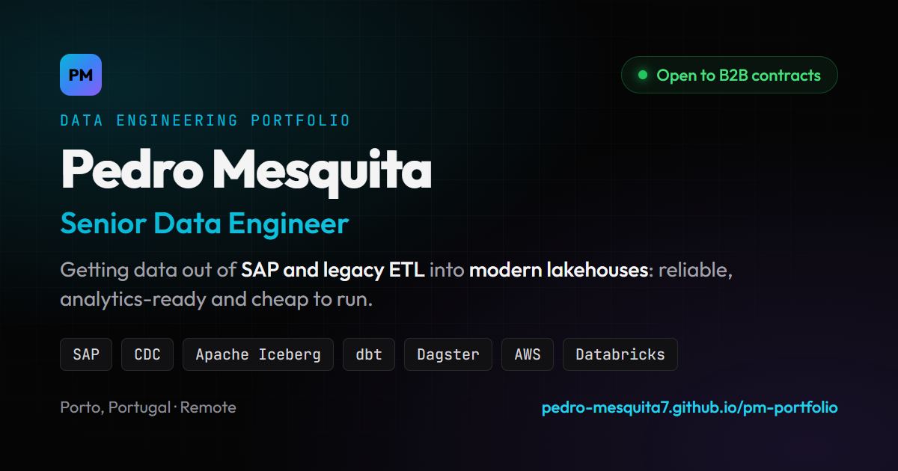

# Pedro Mesquita · Data Engineering Portfolio

**Live:** [pedro-mesquita7.github.io/pm-portfolio](https://pedro-mesquita7.github.io/pm-portfolio/)



Personal site of a Senior Data Engineer who specialises in getting data out of **SAP and legacy ETL** into **modern lakehouses**. Open to B2B contracts.

## What's on the site

- **Services**: SAP data extraction and CDC, legacy ETL migration, lakehouse builds, monitoring and data quality. Each one links to a project that backs it up.
- **Projects**: public repos such as [SAP → Iceberg Lakehouse](https://github.com/pedro-mesquita7/sap-iceberg-lakehouse), [IronLog](https://github.com/pedro-mesquita7/IronLog) and [OpenClaw Security Lakehouse](https://github.com/pedro-mesquita7/openclaw-security-lakehouse), plus summaries of private work projects.
- **Skills** and **contact** details.

## How it's built

A single static `index.html`: hand-written HTML, CSS and vanilla JavaScript. No framework and no build step. GitHub Pages serves it straight from `main`.

- Responsive down to phone width, keyboard accessible (skip link, focus styles, ARIA state on the filters and menu), and respects `prefers-reduced-motion`
- Open Graph / Twitter card metadata and schema.org `Person` structured data for link previews and search
- Fonts: Outfit and JetBrains Mono (Google Fonts). Icons: Font Awesome.

## Run locally

```bash
python -m http.server 3000
```

Then open http://localhost:3000.
